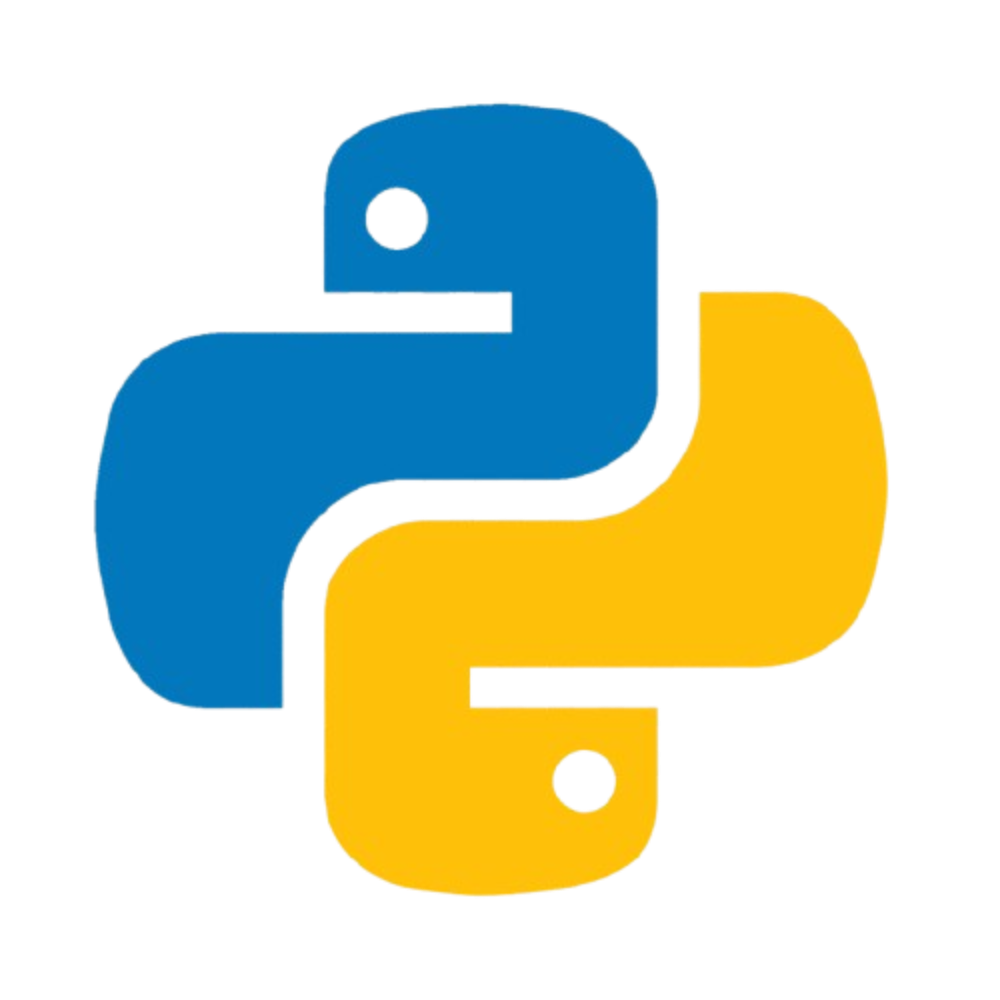
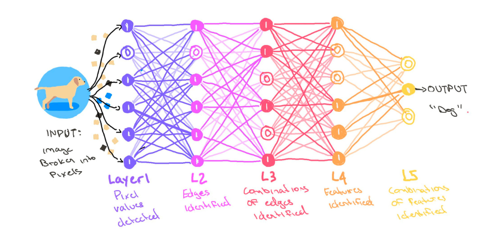
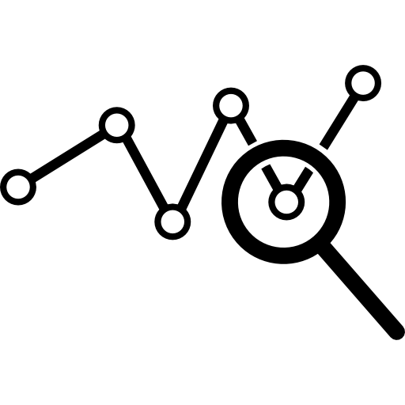
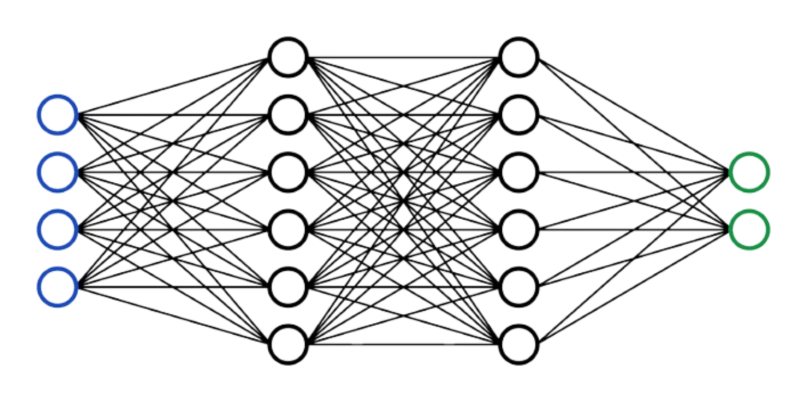
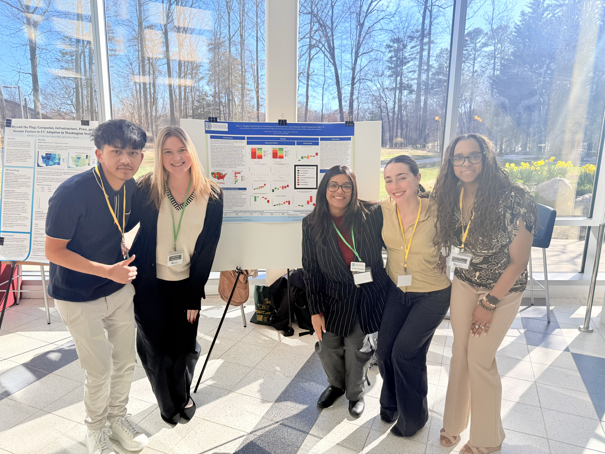
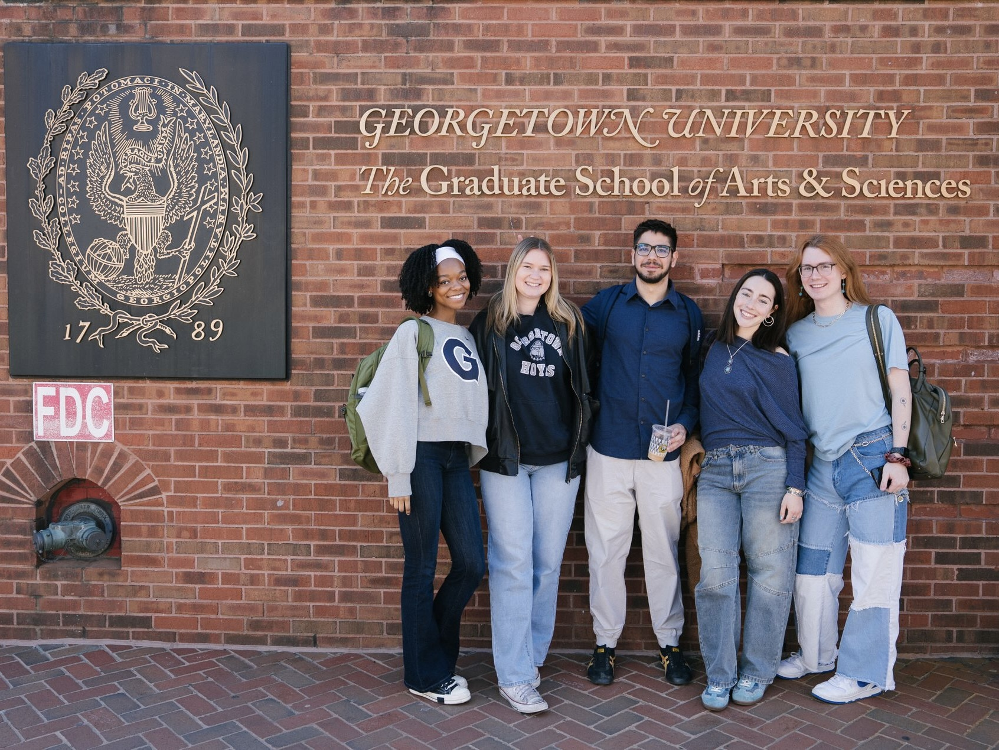
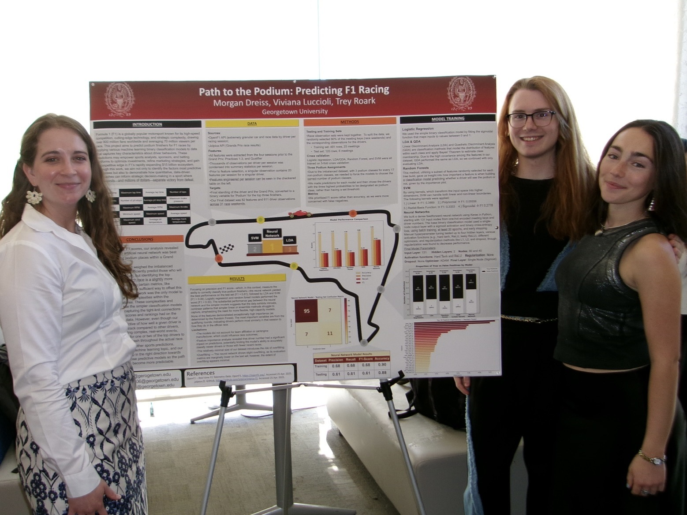
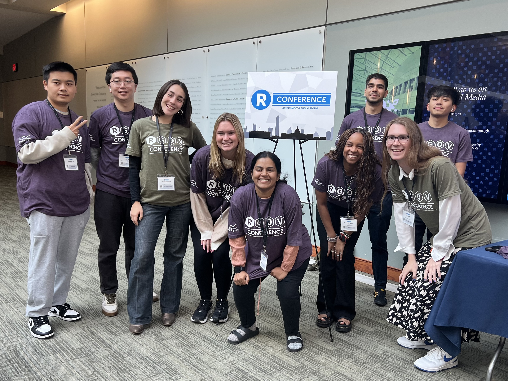

---
format:
  html:
    css: css/ombre.css
    theme: cosmo
    page-layout: full
---

```{=html}
<div class="hero-section">
  <div class="hero-content">
    <p class="typewriter-name" id="typewriter">
      <span id="typed-text"></span><span class="cursor">|</span>
    </p>
    
    <!-- Welcome message that fades in -->
    <p class="welcome-message" id="welcome-message">Welcome to my personal portfolio!</p>
    
    <!-- Floating Data Science Symbols -->
    <div class="floating-symbols" id="floating-symbols">
      <!-- Images - replace src with your own icons/images -->
      
      
      
      
      
      
      
      
      
      
      
    </div>
    
    <p class="hero-subtitle" style="font-size: clamp(1.1rem, 2.5vw, 1.5rem); margin-bottom: 1.5rem;">
      I'm an M.S. Data Science student at Georgetown University, and I'm glad you've found me! Here, you can learn more about me, see my <a href="resume.html" style="color: #ffffff; text-decoration: underline;">resume</a>, and explore some of my <a href="projects.html" style="color: #fd8660; text-decoration: underline;">projects</a>.
    </p>
    <div class="hero-icons">
      <a href="https://www.linkedin.com/in/viviana-luccioli" target="_blank" aria-label="LinkedIn">
        <svg xmlns="http://www.w3.org/2000/svg" viewBox="0 0 24 24">
          <path d="M19 0h-14c-2.761 0-5 2.239-5 5v14c0 2.761 2.239 5 5 5h14c2.762 0 5-2.239 5-5v-14c0-2.761-2.238-5-5-5zm-11 19h-3v-11h3v11zm-1.5-12.268c-.966 0-1.75-.79-1.75-1.764s.784-1.764 1.75-1.764 1.75.79 1.75 1.764-.783 1.764-1.75 1.764zm13.5 12.268h-3v-5.604c0-3.368-4-3.113-4 0v5.604h-3v-11h3v1.765c1.396-2.586 7-2.777 7 2.476v6.759z"/>
        </svg>
      </a>
      <a href="mailto:viviluccioli@gmail.com" aria-label="Email">
        <svg xmlns="http://www.w3.org/2000/svg" viewBox="0 0 24 24">
          <path d="M0 3v18h24v-18h-24zm6.623 7.929l-4.623 5.712v-9.458l4.623 3.746zm-4.141-5.929h19.035l-9.517 7.713-9.518-7.713zm5.694 7.188l3.824 3.099 3.83-3.104 5.612 6.817h-18.779l5.513-6.812zm9.208-1.264l4.616-3.741v9.348l-4.616-5.607z"/>
        </svg>
      </a>
      <a href="https://github.com/viviluccioli" target="_blank" aria-label="GitHub">
        <svg xmlns="http://www.w3.org/2000/svg" viewBox="0 0 24 24">
          <path d="M12 0c-6.626 0-12 5.373-12 12 0 5.302 3.438 9.8 8.207 11.387.599.111.793-.261.793-.577v-2.234c-3.338.726-4.033-1.416-4.033-1.416-.546-1.387-1.333-1.756-1.333-1.756-1.089-.745.083-.729.083-.729 1.205.084 1.839 1.237 1.839 1.237 1.07 1.834 2.807 1.304 3.492.997.107-.775.418-1.305.762-1.604-2.665-.305-5.467-1.334-5.467-5.931 0-1.311.469-2.381 1.236-3.221-.124-.303-.535-1.524.117-3.176 0 0 1.008-.322 3.301 1.23.957-.266 1.983-.399 3.003-.404 1.02.005 2.047.138 3.006.404 2.291-1.552 3.297-1.23 3.297-1.23.653 1.653.242 2.874.118 3.176.77.84 1.235 1.911 1.235 3.221 0 4.609-2.807 5.624-5.479 5.921.43.372.823 1.102.823 2.222v3.293c0 .319.192.694.801.576 4.765-1.589 8.199-6.086 8.199-11.386 0-6.627-5.373-12-12-12z"/>
        </svg>
      </a>
    </div>
  </div>
</div>

<script>
document.addEventListener('DOMContentLoaded', function() {
  const name = "Viviana Luccioli";
  const typedText = document.getElementById('typed-text');
  const cursor = document.querySelector('.cursor');
  const welcomeMessage = document.getElementById('welcome-message');
  const symbols = document.querySelectorAll('.float-symbol');
  
  let charIndex = 0;
  let isDeleting = false;
  let symbolsActive = false;
  
  // Typewriter function
  function typeWriter() {
    if (!isDeleting && charIndex <= name.length) {
      typedText.textContent = name.substring(0, charIndex);
      charIndex++;
      
      if (charIndex > name.length) {
        // Finished typing - show welcome message
        setTimeout(() => {
          welcomeMessage.classList.add('visible');
        }, 300);
        
        // Then start floating symbols
        setTimeout(() => {
          symbolsActive = true;
          activateSymbols();
        }, 800);
        
        // Wait then start deleting
        setTimeout(() => {
          isDeleting = true;
          symbolsActive = false;
          hideAllSymbols();
          welcomeMessage.classList.remove('visible');
          setTimeout(typeWriter, 400);
        }, 5000);
      } else {
        setTimeout(typeWriter, 120);
      }
    } else if (isDeleting && charIndex >= 0) {
      typedText.textContent = name.substring(0, charIndex);
      charIndex--;
      
      if (charIndex < 0) {
        // Finished deleting - restart
        isDeleting = false;
        setTimeout(typeWriter, 800);
      } else {
        setTimeout(typeWriter, 60);
      }
    }
  }
  
  // Activate floating symbols with staggered timing
  function activateSymbols() {
    symbols.forEach((symbol, index) => {
      // Position symbols in a very wide ellipse, far from center
      const angle = (index / symbols.length) * 360;
      const radiusX = 450 + Math.random() * 120; // Even wider horizontal spread
      const radiusY = 280 + Math.random() * 100;  // Taller vertical spread
      const x = Math.cos(angle * Math.PI / 180) * radiusX;
      const y = Math.sin(angle * Math.PI / 180) * radiusY;
      
      symbol.style.setProperty('--x-pos', `${x}px`);
      symbol.style.setProperty('--y-pos', `${y}px`);
      
      setTimeout(() => {
        if (symbolsActive) {
          symbol.classList.add('active');
          
          // Pop out after random duration
          setTimeout(() => {
            symbol.classList.remove('active');
            
            // Pop back in if still active
            if (symbolsActive) {
              setTimeout(() => {
                if (symbolsActive) {
                  symbol.classList.add('active');
                }
              }, 300 + Math.random() * 500);
            }
          }, 800 + Math.random() * 1500);
        }
      }, index * 150);
    });
  }
  
  function hideAllSymbols() {
    symbols.forEach(symbol => {
      symbol.classList.remove('active');
    });
  }
  
  // Continuous symbol animation loop
  setInterval(() => {
    if (symbolsActive) {
      symbols.forEach((symbol, index) => {
        if (Math.random() > 0.7) {
          symbol.classList.toggle('active');
        }
      });
    }
  }, 1000);
  
  // Start the animation
  typeWriter();
});
</script>
```

```{=html}
<div class="content-wrapper">

<div class="bio-section">
  <h2 style="text-align: center; margin-bottom: 2rem; grid-column: 1 / -1;">About Me</h2>
  
  <div class="bio-image">
    
  </div>
  
  <div class="bio-text">
    <p class="greeting">Hi, I'm <span class="gradient-name">Viviana</span>! <span class="wave">👋</span></p>
    <p>I am a second-year M.S. student in Georgetown University's Data Science and Analytics program, graduating in May 2026. Alongside my studies, I intern part-time at the Federal Reserve Board in Washington, D.C., where I build dashboards and automation processes in the IT Statistics & Data Management division while also collaborating through the AI program with senior economists and researchers in Financial Stability and International Finance to develop AI agents and research assistants (using novel tools such as LangChain and LangGraph) that enhance and support their critical research.</p>
  </div>
</div>

```

I enjoy being actively involved in the Georgetown community. I currently serve as a Professional Development Center assistant, where I help fellow data science students refine their resumes and cover letters for maximum impact in technical fields. I also contribute blog posts to our program website. Furthermore, last year, I worked as a research assistant in Dr. Qiwei (Britt) He's AI Measurement and Development (AIMD) Lab and served as a teaching assistant for DSAN 6150: Biological and Biomedical Data Science.

I also hold two Bachelors degrees from the University of Virginia in Applied Statistics (with a concentration in Biostatistics) and Global Public Health.


::: {.about-grid}
::: {.about-card}
### ⭐ Interests
- Agentic AI 
- Interactive Data Visualization
- Image Processing 
- AI Research 
- Machine Learning App Deployment
:::

::: {.about-card}
### 🌎 Other
- I am fluent in **English, Italian**, and **Spanish**! (and I speak a bit of French)
- I'm both a U.S. and E.U. citizen
- Former piano and voice instructor to young children
- Originally from Falls Church, VA
:::
:::


```{=html}
<div class="highlights-container">
  <h2 style="text-align: center; margin-bottom: 2rem;">Highlights</h2>
</div>
```

- Recipient of Georgetown University’s Merit Scholarship (2024, 2025)
- Nominee, Georgetown 2025 Graduate Student Awards
- First Place, DC Metro StatConnect Conference – Graduate Research Paper Competition
- Pending Research Publications:
  - Co-author on a paper with the Federal Reserve Board AI research team, submitted to the IEEE Big Data Conference 2025
  - Collaborating with Program Director Dr. Purna Gamage on a publication originating from a class final project


```{=html}
<div class="tech-stack-container">
  <h2 style="text-align: center; margin-bottom: 2rem;">Tech Stack</h2>
  
  <div class="legend">
    <div class="legend-item">
      <div class="legend-color cat-languages"></div>
      <span>Programming Languages</span>
    </div>
    <div class="legend-item">
      <div class="legend-color cat-ml"></div>
      <span>Machine Learning</span>
    </div>
    <div class="legend-item">
      <div class="legend-color cat-stats"></div>
      <span>Statistical Methods</span>
    </div>
    <div class="legend-item">
      <div class="legend-color cat-data"></div>
      <span>Data Engineering</span>
    </div>
    <div class="legend-item">
      <div class="legend-color cat-cloud"></div>
      <span>Cloud & Big Data</span>
    </div>
    <div class="legend-item">
      <div class="legend-color cat-tools"></div>
      <span>Development Tools</span>
    </div>
    <div class="legend-item">
      <div class="legend-color cat-viz"></div>
      <span>Visualization & BI</span>
    </div>
  </div>

  <div class="bubbles-container">
    <!-- Programming Languages -->
    <div class="bubble cat-languages has-children">
      Python
      <div class="sub-bubbles">
        <div class="sub-bubble cat-languages">PyTorch</div>
        <div class="sub-bubble cat-languages">Keras</div>
        <div class="sub-bubble cat-languages">TensorFlow</div>
        <div class="sub-bubble cat-languages">Scikit-learn</div>
        <div class="sub-bubble cat-languages">SciPy</div>
        <div class="sub-bubble cat-languages">NLTK</div>
        <div class="sub-bubble cat-languages">XGBoost</div>
        <div class="sub-bubble cat-languages">StatsModels</div>
        <div class="sub-bubble cat-languages">Hugging Face</div>
      </div>
    </div>

    <div class="bubble cat-languages has-children">
      R
      <div class="sub-bubbles">
        <div class="sub-bubble cat-languages">dplyr</div>
        <div class="sub-bubble cat-languages">ggplot2</div>
        <div class="sub-bubble cat-languages">shiny</div>
        <div class="sub-bubble cat-languages">lubridate</div>
        <div class="sub-bubble cat-languages">purrr</div>
        <div class="sub-bubble cat-languages">tidyr</div>
        <div class="sub-bubble cat-languages">tidymodels</div>
        <div class="sub-bubble cat-languages">leaflet</div>
        <div class="sub-bubble cat-languages">timetk</div>
      </div>
    </div>

    <div class="bubble cat-languages">SQL</div>
    <div class="bubble cat-languages">HTML/CSS</div>
    <div class="bubble cat-languages">Java</div>
    <div class="bubble cat-languages">SAS</div>
    <div class="bubble cat-languages">SPSS</div>

    <!-- Machine Learning -->
    <div class="bubble cat-ml has-children">
      Deep Learning
      <div class="sub-bubbles">
        <div class="sub-bubble cat-ml">Neural Networks</div>
        <div class="sub-bubble cat-ml">CNNs</div>
        <div class="sub-bubble cat-ml">RNNs</div>
        <div class="sub-bubble cat-ml">Transformers</div>
      </div>
    </div>

    <div class="bubble cat-ml has-children">
      NLP
      <div class="sub-bubbles">
        <div class="sub-bubble cat-ml">LLMs</div>
        <div class="sub-bubble cat-ml">BERT</div>
        <div class="sub-bubble cat-ml">DistilBERT</div>
        <div class="sub-bubble cat-ml">FinBERT</div>
        <div class="sub-bubble cat-ml">Machine Translation</div>
        <div class="sub-bubble cat-ml">Topic Modeling</div>
        <div class="sub-bubble cat-ml">Information Retrieval</div>
        <div class="sub-bubble cat-ml">Semantic Analysis</div>
      </div>
    </div>

    <div class="bubble cat-ml has-children">
      Classification
      <div class="sub-bubbles">
        <div class="sub-bubble cat-ml">SVM</div>
        <div class="sub-bubble cat-ml">Logistic Regression</div>
        <div class="sub-bubble cat-ml">Random Forests</div>
        <div class="sub-bubble cat-ml">GBDT</div>
        <div class="sub-bubble cat-ml">LDA/QDA</div>
      </div>
    </div>

    <div class="bubble cat-ml">Regression</div>

    <div class="bubble cat-ml has-children">
      Unsupervised Learning
      <div class="sub-bubbles">
        <div class="sub-bubble cat-ml">PCA</div>
        <div class="sub-bubble cat-ml">t-SNE</div>
        <div class="sub-bubble cat-ml">K-means</div>
        <div class="sub-bubble cat-ml">Hierarchical Clustering</div>
        <div class="sub-bubble cat-ml">DBSCAN</div>
      </div>
    </div>

    <!-- Statistical Methods -->
    <div class="bubble cat-stats">Bayesian Statistics</div>
    <div class="bubble cat-stats">Time Series Analysis</div>
    <div class="bubble cat-stats">Survival Analysis</div>
    <div class="bubble cat-stats">Multivariate Analysis</div>

    <!-- Data Engineering -->
    <div class="bubble cat-data">DevOps</div>
    <div class="bubble cat-data">Database Design</div>
    <div class="bubble cat-data">ETL Pipelines</div>
    <div class="bubble cat-data">APIs</div>
    <div class="bubble cat-data">Image Processing</div>
    <div class="bubble cat-data has-children">
      Web Applications
      <div class="sub-bubbles">
        <div class="sub-bubble cat-data">Streamlit</div>
        <div class="sub-bubble cat-data">Flask</div>
      </div>
    </div>

    <!-- Cloud & Big Data -->
    <div class="bubble cat-cloud">AWS</div>
    <div class="bubble cat-cloud">Azure</div>
    <div class="bubble cat-cloud">Hadoop</div>
    <div class="bubble cat-cloud">Spark</div>
    <div class="bubble cat-cloud has-children">
      Modern Data Tools
      <div class="sub-bubbles">
        <div class="sub-bubble cat-cloud">Polars</div>
        <div class="sub-bubble cat-cloud">DuckDB</div>
        <div class="sub-bubble cat-cloud">Salt CLI</div>
      </div>
    </div>

    <!-- Development Tools -->
    <div class="bubble cat-tools">LangChain</div>
    <div class="bubble cat-tools">LangGraph</div>
    <div class="bubble cat-tools">Git</div>
    <div class="bubble cat-tools">GitHub</div>
    <div class="bubble cat-tools">Docker</div>
    <div class="bubble cat-tools">VS Code</div>

    <!-- Visualization & BI -->
    <div class="bubble cat-viz">Tableau</div>
    <div class="bubble cat-viz">Power BI</div>
    <div class="bubble cat-viz">Excel</div>
    <div class="bubble cat-viz">Data Visualization</div>
  </div>
</div>

<style>
.tech-stack-container { padding: 2rem 0; }
.legend { display: flex; flex-wrap: wrap; gap: 1.5rem; margin-bottom: 3rem; justify-content: center; }
.legend-item { display: flex; align-items: center; gap: 0.5rem; font-size: 0.9rem; }
.legend-color { width: 20px; height: 20px; border-radius: 50%; }
.bubbles-container { display: flex; flex-wrap: wrap; gap: 1rem; justify-content: center; align-items: center; min-height: 400px; position: relative; padding: 0 2vw; }
.bubbles-container:has(.bubble:hover) .bubble:not(:hover) { filter: blur(2px); opacity: 0.5; }
.bubble { padding: 1rem 1.5rem; border-radius: 50px; color: white; font-weight: 600; cursor: pointer; transition: all 0.3s ease; box-shadow: 0 4px 12px rgba(0,0,0,0.15); position: relative; text-align: center; font-size: 0.95rem; }
.bubble:hover { transform: scale(1.05); box-shadow: 0 6px 20px rgba(0,0,0,0.25); z-index: 1000; filter: none; opacity: 1; }
.bubble.has-children:hover { transform: scale(1.1); }
.sub-bubbles { position: absolute; display: none; flex-wrap: wrap; gap: 0.5rem; z-index: 1001; max-width: 400px; padding: 1rem; background: rgba(255,255,255,0.98); border-radius: 15px; box-shadow: 0 8px 24px rgba(0,0,0,0.3); top: 100%; left: 50%; transform: translateX(-50%); margin-top: 0.5rem; }
.bubble:hover .sub-bubbles { display: flex; }
.sub-bubble { padding: 0.5rem 1rem; border-radius: 20px; font-size: 0.8rem; font-weight: 500; color: white; white-space: nowrap; }
.cat-languages { background: #7462be; }
.cat-ml { background: #93199f; }
.cat-stats { background: #fd8660; }
.cat-data { background: #f0658d; }
.cat-cloud { background: #fb416d; }
.cat-tools { background: #d75ea5; }
.cat-viz { background: #fe6967; }
</style>
```

::: {.full-bleed-grid layout="[[1,1], [1,1]]"}







:::


::: {.band-rose}
## Let's Connect 💌 

I love meeting new people and learning from them! I would be happy to hear from you if you have any questions about my experience, are looking to collaborate on a project, or just want to chat. 

(And I am also always open to book recommendations 😊 )
:::

</div>

