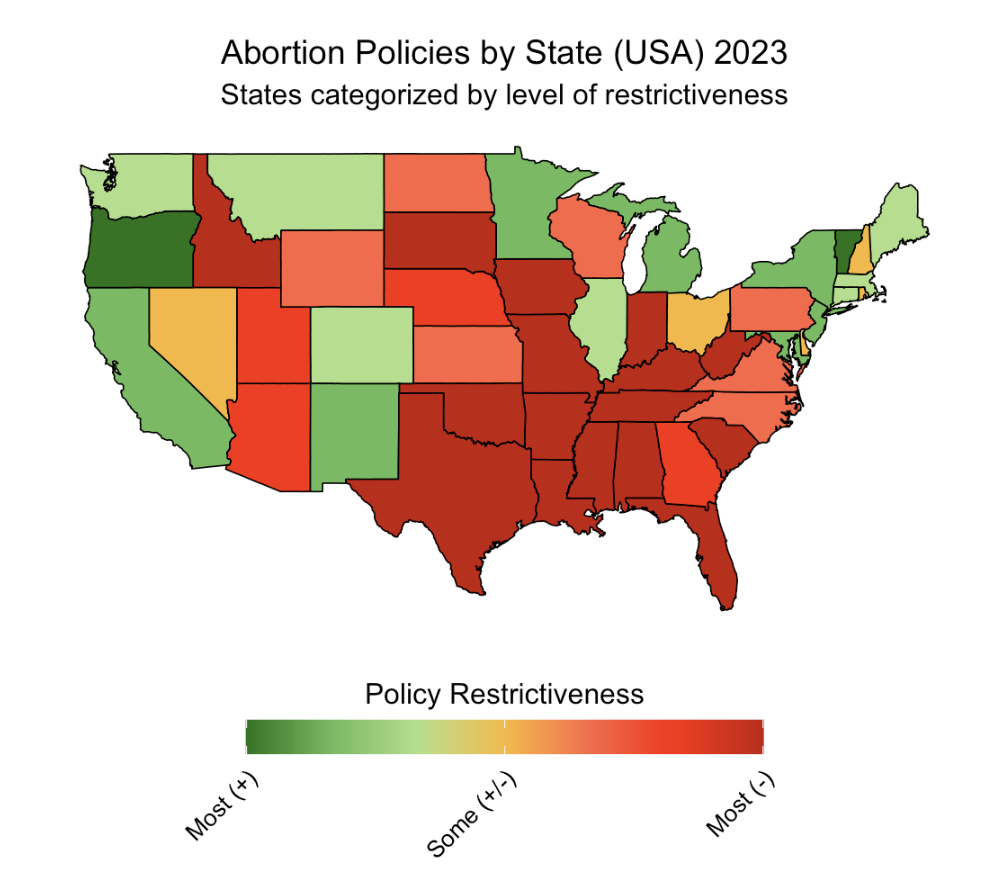
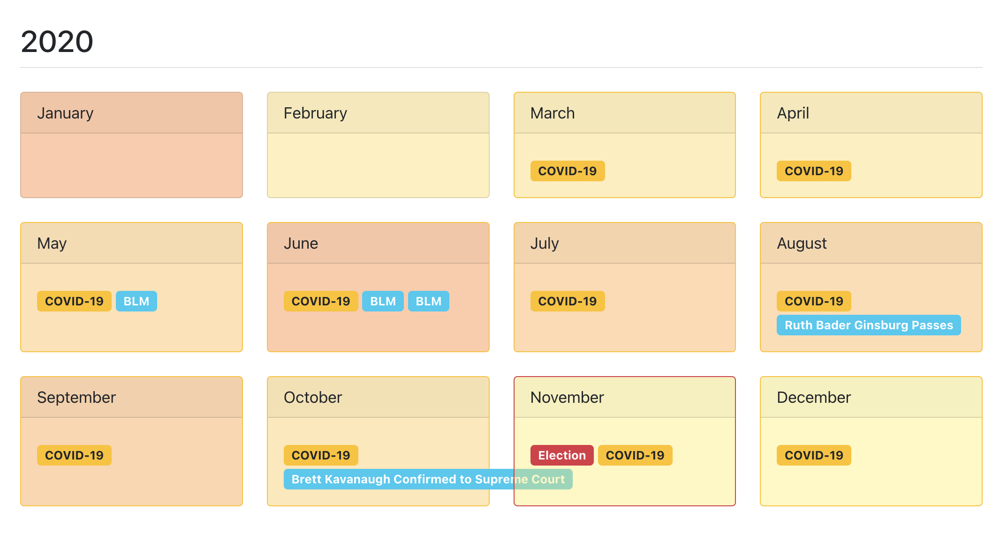

# PORTFOLIO

::: {#filter-buttons}
[Show all]{.filter-btn .active data-filter="all"}
[Georgetown]{.filter-btn data-filter="georgetown"}
[UVA]{.filter-btn data-filter="uva"}
[Data Visualization]{.filter-btn data-filter="dataviz"}
[Public Health]{.filter-btn data-filter="public-health"}
:::

::: {#projects-grid}

::: {.project-card data-category="georgetown dataviz" data-href="projects/dsan-5000/_site/index.html"}
::: {.card-image}

:::
::: {.card-content}
### Hidden Numbers: Human Trafficking in Europe
**Georgetown University • DSAN 5000**

Comprehensive analysis using machine learning to understand factors influencing human trafficking detection and government response across Europe.
:::
:::

::: {.project-card data-category="georgetown public-health dataviz" data-href="projects/dsan-5100/_site/index.html"}
::: {.card-image}

:::
::: {.card-content}
### Data vs. Dogma: Maternal Wellness & Abortion Policy
**Georgetown University • DSAN 5100**

Statistical analysis exploring relationships between state-level maternal health outcomes and abortion policies post-Dobbs decision.
:::
:::

::: {.project-card data-category="georgetown dataviz" data-href="projects/dsan-5400/index.html"}
::: {.card-image}

:::
::: {.card-content}
### US Media Coverage NLP Analysis
**Georgetown University • DSAN 5400**

The analysis uses advanced data visualization, topic modeling and sentiment analysis to identify patterns in coverage between right-leaning, neutral, and left-leaning news organizations.
:::
:::

::: {.project-card data-category="uva public-health" data-href="projects/GPH-capstone/GPH_capstone.html"}
::: {.card-image}

:::
::: {.card-content}
### Capstone Thesis
**University of Virginia • Global Public Health Capstone Thesis**

In-depth epidemiological research examining global health disparities and intervention strategies across diverse populations.
:::
:::

::: {.project-card data-category="georgetown dataviz" data-href="projects/dsan-5200/docs/index.html"}
::: {.card-image}

:::
::: {.card-content}
### Advanced Data Visualization
**Georgetown University • DSAN 5200**

Interactive dashboards and visual narratives using D3.js, Plotly, and ggplot2 to transform complex data into accessible insights.
:::
:::

:::
```{=html}
<script>
document.addEventListener('DOMContentLoaded', function() {
  const filterButtons = document.querySelectorAll('.filter-btn');
  const projectCards = document.querySelectorAll('.project-card');
  
  // Filter functionality
  filterButtons.forEach(button => {
    button.addEventListener('click', function() {
      // Update active button
      filterButtons.forEach(btn => btn.classList.remove('active'));
      this.classList.add('active');
      
      const filter = this.getAttribute('data-filter');
      
      projectCards.forEach(card => {
        if (filter === 'all') {
          card.style.display = 'flex';
          card.classList.add('fade-in');
        } else {
          const categories = card.getAttribute('data-category');
          if (categories.includes(filter)) {
            card.style.display = 'flex';
            card.classList.add('fade-in');
          } else {
            card.style.display = 'none';
            card.classList.remove('fade-in');
          }
        }
      });
    });
  });
  
  // Click to navigate
  projectCards.forEach(card => {
    card.addEventListener('click', function() {
      const href = this.getAttribute('data-href');
      window.location.href = href;
    });
  });
});
</script>