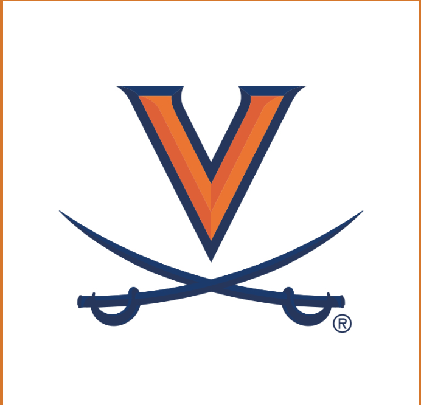
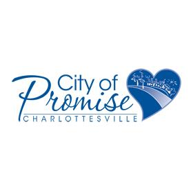
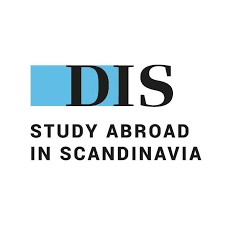
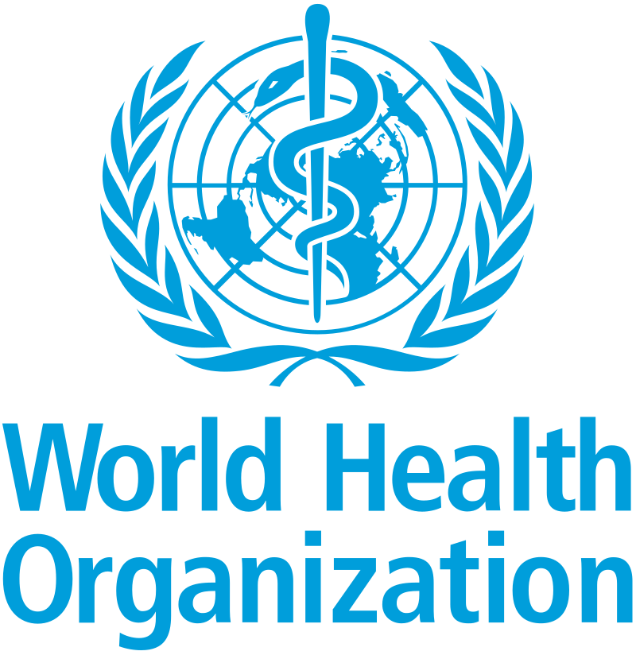
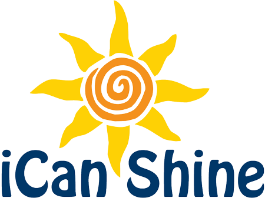

---
format:
  html:
    css: css/ombre.css
    theme: cosmo
---

# Education

<table style="width: 100%; border: none;">
<tr style="vertical-align: top; border: none;">
  <td style="width: 60px; padding-right: 15px; border: none;">
    
  </td>
  <td style="border: none;">
    <strong>Georgetown University</strong>, 2024-2026 
    <em>M.S. Data Science & Analytics</em>
    <ul>
      <li>GPA: 4.0</li>
      <li>Professional Development Center assistant (check out my blogs <a href="link-to-blogs">here</a>!)</li>
      <li><strong>Coursework:</strong> Statistical Learning, Advanced Data Visualization, Computational Linguistics with Advanced Python, Neural Networks and Deep Learning, Big Data and Cloud Computing, Machine Learning App Deployment</li>
    </ul>
  </td>
</tr>
</table>

<table style="width: 100%; border: none; margin-top: 30px;">
<tr style="vertical-align: top; border: none;">
  <td style="width: 60px; padding-right: 15px; border: none;">
    
  </td>
  <td style="border: none;">
    <strong>University of Virginia</strong>, 2020-2024 
    <em>B.A. Applied Statistics + B.A. Global Public Health</em>
    <ul>
      <li>President of the Global Infectious Diseases Association</li>
      <li>Madison House volunteer</li>
    </ul>
  </td>
</tr>
</table>

# Experience

<table style="width: 100%; border: none; margin-top: 30px;">
<tr style="vertical-align: top; border: none;">
  <td style="width: 60px; padding-right: 15px; border: none;">
    
  </td>
  <td style="border: none;">
    <strong>Statistics & Data Managament Intern</strong>, May 2025 - Present 
    <em>Federal Reserve Board</em>
    <ul>
      <li>Full time summer intern in IT Financial Statistics (May-August 2025), part time continuing intern in Financial Stability’s Cyber and AI Sentinel Lab</li>
      <li>Collaborating with senior economists and researchers to develop data visualization AI agent (using FastAPI endpoints with Streamlit UI) that generates publish-ready visualizations using internal R packages, to support economic research processes</li>
      <li>Building dashboards (PowerBI, Python) and automating ETL processes (Python, R) in the IT Statistics & Data Management division</li>
      <li>[Co-authored a paper accepted in IEEE Big Data 2025](https://www.arxiv.org/pdf/2511.11574) introducing M-RARU, a novel active learning algorithm combining knowledge distillation and uncertainty sampling to reduce LLM training cost while preserving accuracy</li>
      <li>Presenting technical projects in high-profile conferences and showcases to 400+ economists and researchers </li>
    </ul>
  </td>
</tr>
</table>

<table style="width: 100%; border: none; margin-top: 30px;">
<tr style="vertical-align: top; border: none;">
  <td style="width: 60px; padding-right: 15px; border: none;">
    
  </td>
  <td style="border: none;">
    <strong>Professional Development Center Assistant</strong>, August 2024 - Present 
    <em>Georgetown Data Science & Analytics</em>
    <ul>
      <li>Mentoring and assisting peers in professional writing and communication, tailored to data science</li>
    </ul>
     
    <strong>Research Assistant</strong>, October 2024 - May 2025 
    <em>AI Measurement & Development Lab</em>
    <ul>
      <li>Part-time assistant in Dr. Qiwei (Britt) He's AIMD lab, in affiliation with Georgetown's Data Science and Analytics program</li>
      <li>Comprehensively scan and extract key information on the technical characteristics and methods of psychometric data capturing of various virtual reality (VR) tools in educational settings</li>
      <li>Perform statistical analysis on the trends in technical components of VR in education across the literature</li>
    </ul>
  </td>
</tr>
</table>

<table style="width: 100%; border: none; margin-top: 30px;">
<tr style="vertical-align: top; border: none;">
  <td style="width: 60px; padding-right: 15px; border: none;">
    
  </td>
  <td style="border: none;">
    <strong>Data Management & Engineering Intern</strong>, October 2023 - August 2024  
    <em>City of Promise</em>
    <ul>
      <li>Contributed to the configuration of a new internal database and created a tailored self sufficiency matrix encapsulating 16 variables with 5 category scores to quantify the socioeconomic and personal impact of the program on individuals and families</li>
      <li>Consulted the leadership board on data-driven methods and strategies for community polling and data collection</li>
      <li>Assisted in the creation and deployment of the organization’s database and taught staff how to input and extract data</li>
      <li> Performed data analytics and communicated findings through presentations and creating executive summary reports for fundraising and board meetings </li>
    </ul>
  </td>
</tr>
</table>

<table style="width: 100%; border: none; margin-top: 30px;">
<tr style="vertical-align: top; border: none;">
  <td style="width: 60px; padding-right: 15px; border: none;">
    
  </td>
  <td style="border: none;">
    <strong>Research Assistant</strong>, January 2023 - May 2023 
    <em>Danish Institute of Scandinavia</em>
    <ul>
      <li>Worked closely with a Swedish research team to contribute to a long-term, multidimensional project examining illicit organ trafficking while studying abroad in Stockholm, Sweden</li>
      <li>Parsed the dark web for insight and interviewed medical and organ-related professionals around the world</li>
      <li>Contributed to a team systematic review</li>
    </ul>
  </td>
</tr>
</table>

<table style="width: 100%; border: none; margin-top: 30px;">
<tr style="vertical-align: top; border: none;">
  <td style="width: 60px; padding-right: 15px; border: none;">
    
  </td>
  <td style="border: none;">
    <strong>Research Assistant</strong>, September 2022 - December 2022 
    <em>World Health Organization</em>
    <ul>
      <li>Selected by a professor to assist in the research for informing the rewriting of WHO guidelines</li>
      <li>Revised international guidelines on controlled medicine policy by conducting vast web scanning, data extraction and synthesis on over 200 sudies, and writing a literature review and reported formatted findings to the project lead</li>
      <li>Gained insight into IGO policy development and deepened research skills</li>
    </ul>
  </td>
</tr>
</table>

<table style="width: 100%; border: none; margin-top: 30px;">
<tr style="vertical-align: top; border: none;">
  <td style="width: 60px; padding-right: 15px; border: none;">
    
  </td>
  <td style="border: none;">
    <strong>Dance Instructor</strong>, March 2019 - August 2022 
    <em>iCan Shine</em>
    <ul>
      <li>Traveled to various states to instruct week-long camps and led communication with host facilities</li>
      <li>Choreographed and taught dance routines five times a day to classes of up to 30 individuals with disabilities</li>
      <li>Wrote disability awareness lesson plans and educated typically developing volunteers</li>
    </ul>
  </td>
</tr>
</table>

In document form:

- [Viviana Luccioli's Resume](https://docs.google.com/document/d/1FJmF-aAWmWE2DYkRWv6BHljvNenv9DT4JgAimWyKvyE/edit?tab=t.0)
- [Viviana Luccioli's CV](https://docs.google.com/document/d/1fMLmd-MIUYKjNnaf_eOWSkMJHC_2f0fsqofz3PLsUpI/edit?tab=t.0)